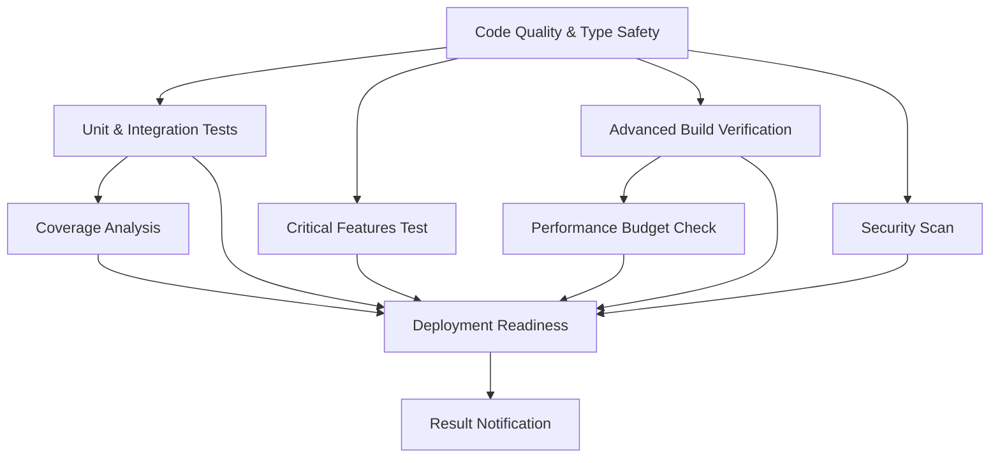

# CI/CD Pipeline Documentation

## Overview

This document describes the comprehensive CI/CD pipeline for the INOPNC Work Management System, enhanced with advanced build verification and performance monitoring.

## Pipeline Architecture

### Core Workflow: `ci.yml`

The main CI/CD pipeline integrates the project's advanced build verification script (`scripts/verify-build.sh`) with comprehensive quality gates and performance monitoring.

#### Job Flow



### Enhanced Build Verification

#### Key Features
- **Advanced Script Integration**: Leverages `scripts/verify-build.sh` with comprehensive checks
- **Performance Monitoring**: Sub-30s target, 45s absolute threshold
- **Quality Gates**: Zero-warning enforcement for production builds
- **Matrix Strategy**: Production and fast build modes
- **Intelligent Caching**: Next.js build optimization
- **Comprehensive Analytics**: Build metrics and trend analysis

#### Build Modes

| Mode | Flags | Purpose | Cache Key | Timeout |
|------|-------|---------|-----------|---------|
| **Production** | `--ci` | Full verification | `prod` | 15 min |
| **Fast** | `--ci --fast` | Quick feedback | `fast` | 15 min |

### Performance Targets

| Metric | Target | Acceptable | Critical |
|--------|--------|------------|----------|
| **Build Time** | ≤30s 🟢 | ≤45s 🟡 | >45s 🔴 |
| **Build Warnings** | 0 ✅ | 0 ⚠️ | >0 ❌ |
| **CI Duration** | ≤15min | ≤20min | >20min |
| **Success Rate** | ≥95% | ≥80% | <80% |

## Workflow Details

### 1. Code Quality & Type Safety (Job 1)
- **Duration**: ~5 minutes
- **Checks**: Parallel TypeScript type checking, ESLint analysis (0 warnings), document sync verification
- **Integration**: Uses `npm run type-check:parallel` for optimized performance
- **Artifacts**: ESLint reports, type check results

### 2. Unit & Integration Tests (Job 2)
- **Matrix Strategy**: Unit and integration test suites
- **Coverage**: Enforced with Codecov integration
- **Duration**: ~10 minutes
- **Threshold**: ≥70% coverage required

### 3. Critical Features Test (Job 3)
- **Purpose**: Validates protected authentication files and core functionality
- **Script**: `npm run test:critical`
- **Blocking**: Deployment blocked on failure
- **Duration**: ~5 minutes

### 4. Advanced Build Verification (Job 4) ⭐
- **Script**: `scripts/verify-build.sh --ci` (production) / `--ci --fast` (fast mode)
- **Features**:
  - Comprehensive TypeScript type checking
  - ESLint quality verification (0 warnings enforced)
  - Production build with timeout protection (60s)
  - Performance monitoring & trend analysis
  - Build artifact validation
  - Automated failure pattern detection
  - Memory optimization (4GB heap)
- **Caching**: Intelligent Next.js build caching
- **Metrics**: Extracted and reported in PR comments
- **Performance Regression**: Automatic detection and warnings

### 5. End-to-End Tests (Job 5)
- **Browsers**: Chromium, Firefox, WebKit
- **Conditional**: Runs on non-draft PRs and main branch pushes
- **Duration**: ~20 minutes
- **Dependencies**: Requires successful build verification

### 6. Security & Dependency Audit (Job 6)
- **Checks**: NPM audit for high/critical vulnerabilities
- **Blocking**: Critical vulnerabilities prevent deployment
- **Reports**: JSON audit reports with detailed analysis

### 7. Performance Budget Check (Job 7)
- **Budget**: 2MB JavaScript bundle limit
- **Analysis**: Bundle size monitoring and alerts
- **Dependencies**: Uses production build artifacts

### 8. Coverage Analysis (Job 8)
- **Merging**: Combines unit and integration coverage
- **Threshold**: 70% minimum required
- **PR Comments**: Detailed coverage reports

### 9. Deployment Readiness (Job 9)
- **Logic**: Evaluates all job outcomes
- **Categories**:
  - ✅ **Ready**: All checks passed
  - ⚠️ **Cautioned**: Non-critical issues
  - ❌ **Blocked**: Critical failures
- **Enhanced**: Includes build verification status

### 10. Result Notification (Job 10)
- **PR Comments**: Comprehensive CI results table
- **Summary**: Job status, metrics, and recommendations
- **Integration**: Build verification results highlighted

## Branch Protection

### Automated Protection Rules (`branch-protection.yml`)

#### Required Status Checks
- Code Quality & Type Safety
- Unit & Integration Tests (both matrices)
- Critical Features Test
- **Advanced Build Verification** (production mode)
- Security Scan
- Performance Budget Check
- Coverage Analysis

#### Additional Protection
- Pull request reviews required (1 minimum)
- Code owner review required
- Dismiss stale reviews on new commits
- Conversation resolution required
- Force pushes and deletions blocked

### Daily Maintenance
- Runs daily at 2 AM UTC
- Ensures protection rules remain consistent
- Self-healing configuration

## CI Status Monitoring

### Health Monitoring (`ci-status-monitor.yml`)

#### Automated Monitoring
- **Trigger**: After each CI run completion
- **Metrics**: Success rate, average duration, failure trends
- **Alerting**: Automatic issue creation for performance degradation
- **Reporting**: Weekly CI health reports

#### Performance Thresholds
- **Success Rate**: ≥80% (creates alert if below)
- **Average Duration**: ≤20 minutes (creates alert if above)
- **Recent Failures**: ≤3 in last 10 runs

#### Alert Integration
- **Issue Creation**: Automatic performance alert issues
- **Labels**: `ci-performance`, `needs-attention`, `automated`
- **Recommendations**: Actionable steps for improvement

## Advanced Build Script Integration

### Script Features Leveraged
- **Comprehensive Checks**: TypeScript, ESLint, build validation
- **Performance Monitoring**: Build time tracking and trend analysis
- **Quality Gates**: Zero-warning enforcement
- **Error Detection**: Common failure pattern recognition
- **Artifact Validation**: Critical build file verification
- **Logging**: Detailed build logs with metrics export

### CI-Specific Enhancements
- **--ci Flag**: Optimized for CI environment
- **Timeout Protection**: 60-second build timeout
- **Metrics Export**: CI-compatible environment variables
- **Performance Alerts**: Automatic regression detection
- **Cache Integration**: Works with GitHub Actions caching

### Environment Variables
```bash
NODE_ENV=production
NODE_OPTIONS='--max-old-space-size=4096'
NEXT_TELEMETRY_DISABLED=1
CI=true
```

## Caching Strategy

### Next.js Build Cache
```yaml
Cache Key: ${{ runner.os }}-nextjs-${{ matrix.cache-key }}-${{ hashFiles('**/package-lock.json') }}-${{ hashFiles('**.[jt]s', '**.[jt]sx') }}
Paths:
  - ~/.npm
  - .next/cache
```

### Cache Invalidation
- **Lock file changes**: Full cache invalidation
- **Source code changes**: Partial cache invalidation
- **Manual override**: `skip_build_cache` workflow input

## Performance Optimization

### Build Time Optimization
- **Parallel execution**: Multiple jobs run simultaneously
- **Intelligent caching**: Reduced dependency installation time
- **Matrix strategy**: Fast feedback for urgent fixes
- **Timeout protection**: Prevents hanging builds

### Resource Management
- **Memory allocation**: 4GB heap size for builds
- **Concurrent limits**: Controlled job parallelization
- **Artifact cleanup**: Automatic retention management

## Troubleshooting

### Common Issues

#### Build Verification Failures
1. **Timeout**: Check for hanging processes or infinite loops
2. **Memory**: Increase heap size or optimize bundle size
3. **Dependencies**: Run `npm ci` to ensure clean install
4. **TypeScript**: Check for type errors with `npm run type-check`

#### Performance Issues
1. **Slow builds**: Check bundle size and dependencies
2. **Cache misses**: Verify cache key generation
3. **Test timeouts**: Optimize slow tests or increase timeouts

#### Deployment Blocks
1. **Critical tests**: Run `npm run test:critical` locally
2. **Coverage**: Ensure tests cover critical paths
3. **Security**: Fix high/critical vulnerabilities
4. **Quality**: Address ESLint warnings

### Debug Commands
```bash
# Local build verification
./scripts/verify-build.sh --ci

# Check critical features
npm run test:critical

# Performance analysis
npm run test:budget

# Coverage check
npm run test:unit -- --coverage
```

## Metrics and Analytics

### Build Performance Tracking
- **Duration trends**: 10-build rolling average
- **Success rate**: Historical tracking
- **Failure patterns**: Automated analysis
- **Performance regression**: Automatic detection

### Quality Metrics
- **Code coverage**: ≥70% enforced
- **Build warnings**: Zero tolerance
- **Security vulnerabilities**: Continuous monitoring
- **Bundle size**: Performance budget enforcement

### Reporting
- **PR comments**: Detailed build results
- **GitHub summaries**: Visual metrics and trends
- **Issue alerts**: Performance degradation notifications
- **Weekly reports**: Comprehensive CI health status

## Maintenance

### Regular Tasks
- **Weekly**: Review CI health reports
- **Monthly**: Update dependencies and security patches
- **Quarterly**: Review performance thresholds and optimization opportunities

### Monitoring Points
- **Success rate trends**: Watch for declining patterns
- **Build time increases**: Investigate performance regressions
- **Security alerts**: Address vulnerabilities promptly
- **Coverage drops**: Ensure test quality maintenance

---

## Quick Reference

### Key Files
- **Main CI**: `.github/workflows/ci.yml`
- **Build Script**: `scripts/verify-build.sh`
- **Branch Protection**: `.github/workflows/branch-protection.yml`
- **Monitoring**: `.github/workflows/ci-status-monitor.yml`

### Important Commands
- **Build verification**: `./scripts/verify-build.sh --ci`
- **Critical tests**: `npm run test:critical`
- **Type check**: `npm run type-check:parallel`
- **Coverage**: `npm run test:unit -- --coverage`

### Performance Targets
- **Build time**: ≤30s (target), ≤45s (acceptable)
- **CI duration**: ≤15min (target), ≤20min (acceptable)
- **Success rate**: ≥95% (target), ≥80% (minimum)
- **Coverage**: ≥70% (enforced)

This CI/CD system provides comprehensive quality assurance, performance monitoring, and automated deployment readiness checks while leveraging your existing build verification infrastructure for maximum consistency and reliability.