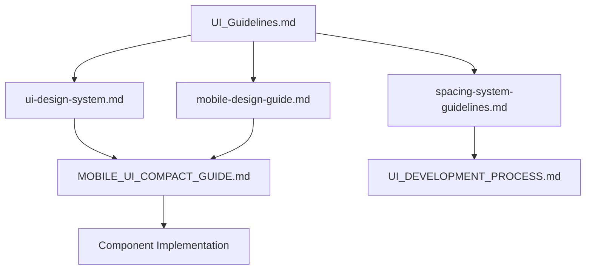
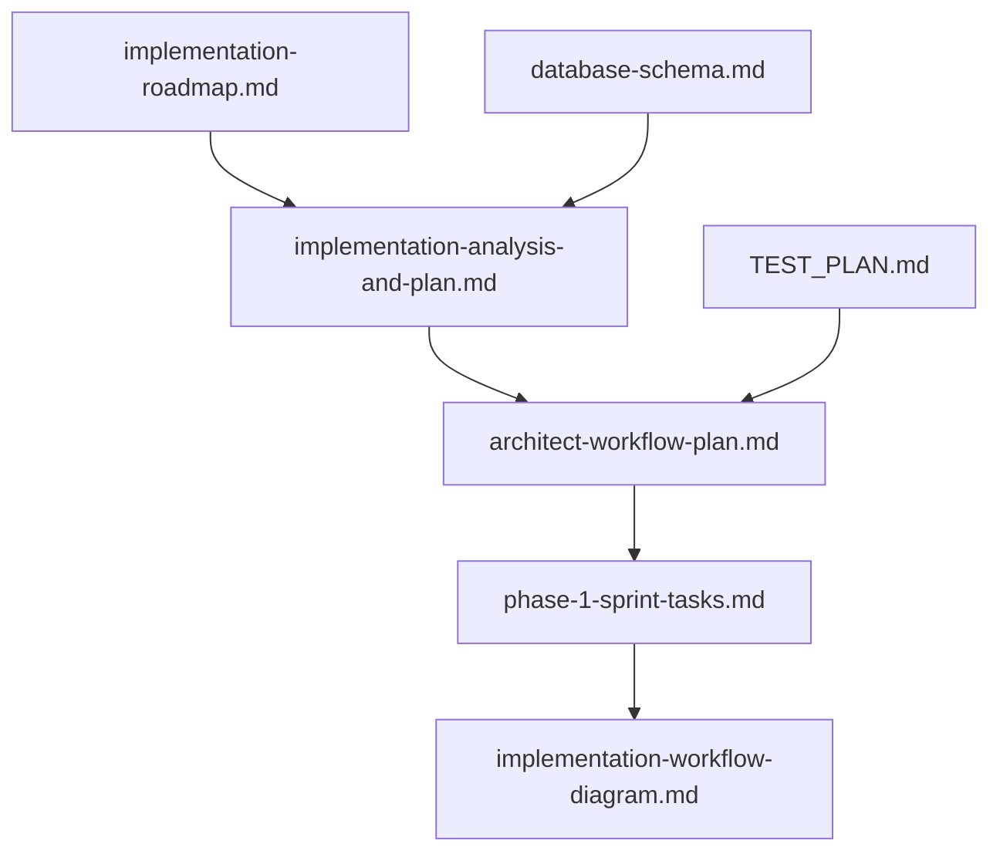
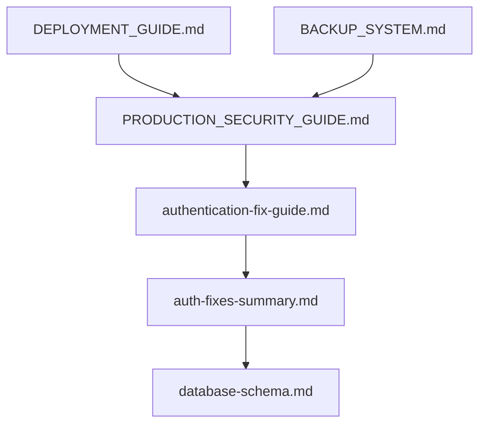

# INOPNC Work Management System - Documentation Navigation

*Intelligent cross-reference and navigation system for comprehensive project documentation*

---

## 🎯 Quick Start Guides by Role

### 👨‍💻 For New Developers
**Start here → Complete in this order:**
1. [README.md](README.md) - Project overview and setup
2. [CLAUDE.md](CLAUDE.md) - AI assistant guidelines and protected files
3. [docs/database-schema.md](docs/database-schema.md) - Database structure
4. [docs/UI_Guidelines.md](docs/UI_Guidelines.md) - UI design system
5. [docs/TEST_PLAN.md](docs/TEST_PLAN.md) - Testing strategy

**Next steps:** Feature-specific documentation based on your assigned work area.

### 🎨 For UX/UI Designers
**Design system foundation:**
1. [docs/UI_Guidelines.md](docs/UI_Guidelines.md) - **Primary design system**
2. [docs/ui-design-system.md](docs/ui-design-system.md) - Component specifications
3. [docs/mobile-design-guide.md](docs/mobile-design-guide.md) - Mobile-first approach
4. [docs/MOBILE_UI_COMPACT_GUIDE.md](docs/MOBILE_UI_COMPACT_GUIDE.md) - Construction-optimized UI
5. [docs/spacing-system-guidelines.md](docs/spacing-system-guidelines.md) - Consistent spacing

**Implementation guides:**
- [docs/UI_DEVELOPMENT_PROCESS.md](docs/UI_DEVELOPMENT_PROCESS.md) - Development workflow
- [docs/UI_GUIDELINES_README.md](docs/UI_GUIDELINES_README.md) - Usage instructions

### 🏢 For Project Managers
**Planning and execution:**
1. [docs/implementation-roadmap.md](docs/implementation-roadmap.md) - **Master roadmap**
2. [docs/implementation-analysis-and-plan.md](docs/implementation-analysis-and-plan.md) - Technical analysis
3. [docs/architect-workflow-plan.md](docs/architect-workflow-plan.md) - Development workflow
4. [docs/phase-1-sprint-tasks.md](docs/phase-1-sprint-tasks.md) - Sprint planning
5. [docs/TEST_EXECUTION_GUIDE.md](docs/TEST_EXECUTION_GUIDE.md) - Quality assurance

**System status:**
- [docs/implementation-workflow-diagram.md](docs/implementation-workflow-diagram.md) - Visual workflow
- [docs/ADMIN_DASHBOARD_IMPLEMENTATION_SUMMARY.md](docs/ADMIN_DASHBOARD_IMPLEMENTATION_SUMMARY.md) - Admin features status

### 🔧 For DevOps Engineers
**Deployment and operations:**
1. [docs/DEPLOYMENT_GUIDE.md](docs/DEPLOYMENT_GUIDE.md) - **Primary deployment guide**
2. [docs/DEPLOYMENT_RUNBOOK.md](docs/DEPLOYMENT_RUNBOOK.md) - Operations procedures
3. [docs/PRODUCTION_SECURITY_GUIDE.md](docs/PRODUCTION_SECURITY_GUIDE.md) - Security checklist
4. [docs/PERFORMANCE_MONITORING.md](docs/PERFORMANCE_MONITORING.md) - System monitoring
5. [docs/BACKUP_SYSTEM.md](docs/BACKUP_SYSTEM.md) - Data protection

**Infrastructure:**
- [docs/DATA_MIGRATION_GUIDE.md](docs/DATA_MIGRATION_GUIDE.md) - Database migrations
- [docs/ANALYTICS_INFRASTRUCTURE.md](docs/ANALYTICS_INFRASTRUCTURE.md) - Analytics setup

---

## 📊 Feature Documentation Matrix

### Core Workforce Management
| Feature | User Guide | Tech Implementation | Testing | Related Components |
|---------|------------|-------------------|---------|-------------------|
| **Attendance System** | [Attendance_Guidelines.md](docs/Attendance_Guidelines.md) | `components/attendance/` | `test:attendance` script | Daily Reports, Site Info |
| **Daily Reports** | [DailyReports_Guidelines.md](docs/DailyReports_Guidelines.md) | `components/daily-reports/` | [worker-assignment-test-report.md](docs/worker-assignment-test-report.md) | Attendance, Materials |
| **Site Management** | [SiteInfo_Guidelines.md](docs/SiteInfo_Guidelines.md) | [site_information_spec.md](docs/site_information_spec.md) | [site-context-integration.md](docs/site-context-integration.md) | All site-related features |

### Document Management Ecosystem
| System | Documentation | Implementation | Integration |
|--------|---------------|----------------|-------------|
| **Personal Documents** | [MyDocuments_Guidelines.md](docs/MyDocuments_Guidelines.md) | `components/documents/` | 3-tab unified system |
| **Shared Documents** | [SharedDocuments_Guidelines.md](docs/SharedDocuments_Guidelines.md) | Same component system | Team collaboration |
| **Blueprint Markup** | [BlueprintMarkupTool_Guidelines.md](docs/BlueprintMarkupTool_Guidelines.md) | [MARKUP_UI_IMPLEMENTATION_RECORD.md](docs/MARKUP_UI_IMPLEMENTATION_RECORD.md) | Canvas-based system |

### Administrative Systems
| System | User Documentation | Technical Guide | Security |
|--------|-------------------|-----------------|----------|
| **Admin Dashboard** | [AdminFeatures_Guidelines.md](docs/AdminFeatures_Guidelines.md) | [ADMIN_DASHBOARD_IMPLEMENTATION_SUMMARY.md](docs/ADMIN_DASHBOARD_IMPLEMENTATION_SUMMARY.md) | [PRODUCTION_SECURITY_GUIDE.md](docs/PRODUCTION_SECURITY_GUIDE.md) |
| **Authentication** | [auth-fixes-summary.md](docs/auth-fixes-summary.md) | [authentication-fix-guide.md](docs/authentication-fix-guide.md) | **Protected files system** |

---

## 🔗 Cross-Reference Map

### UI/UX Design Dependencies

**Key relationships:**
- **UI_Guidelines.md** → Foundation for all UI documentation
- **mobile-design-guide.md** + **MOBILE_UI_COMPACT_GUIDE.md** → Mobile optimization strategies
- **spacing-system-guidelines.md** → Consistent spacing across all components

### Implementation Workflow Dependencies

**Key relationships:**
- **implementation-roadmap.md** → Master plan drives all implementation docs
- **database-schema.md** → Foundation for all backend implementation
- **TEST_PLAN.md** → Quality gates for all development phases

### Security & Authentication Chain

---

## 🎯 Topic-Based Navigation

### Authentication & Security
**Problem solving sequence:**
1. [auth-fixes-summary.md](docs/auth-fixes-summary.md) - Quick fixes overview
2. [authentication-fix-guide.md](docs/authentication-fix-guide.md) - Detailed troubleshooting
3. [PRODUCTION_SECURITY_GUIDE.md](docs/PRODUCTION_SECURITY_GUIDE.md) - Production security
4. [database-schema.md](docs/database-schema.md) - RLS policies reference

### Testing Strategy
**Complete testing workflow:**
1. [TEST_PLAN.md](docs/TEST_PLAN.md) - **Master testing strategy**
2. [TEST_EXECUTION_GUIDE.md](docs/TEST_EXECUTION_GUIDE.md) - Execution procedures
3. [testing-infrastructure-guide.md](docs/testing-infrastructure-guide.md) - Setup and config
4. [worker-assignment-test-report.md](docs/worker-assignment-test-report.md) - Feature-specific example

### Performance & Monitoring
**Performance optimization chain:**
1. [PERFORMANCE_BUDGETS.md](docs/PERFORMANCE_BUDGETS.md) - Performance targets
2. [PERFORMANCE_MONITORING.md](docs/PERFORMANCE_MONITORING.md) - Monitoring setup
3. [ANALYTICS_INFRASTRUCTURE.md](docs/ANALYTICS_INFRASTRUCTURE.md) - Analytics implementation
4. [REFACTORING_GUIDE.md](docs/REFACTORING_GUIDE.md) - Code optimization

### Deployment & Operations
**Deployment workflow:**
1. [DEPLOYMENT_GUIDE.md](docs/DEPLOYMENT_GUIDE.md) - **Primary deployment guide**
2. [DEPLOYMENT_RUNBOOK.md](docs/DEPLOYMENT_RUNBOOK.md) - Step-by-step procedures
3. [DATA_MIGRATION_GUIDE.md](docs/DATA_MIGRATION_GUIDE.md) - Database migrations
4. [BACKUP_SYSTEM.md](docs/BACKUP_SYSTEM.md) - Data protection

---

## 📱 Mobile & PWA Development Path

### Construction-Optimized Mobile UI
**Design progression:**
1. [mobile-design-guide.md](docs/mobile-design-guide.md) - **Mobile-first principles**
2. [MOBILE_UI_COMPACT_GUIDE.md](docs/MOBILE_UI_COMPACT_GUIDE.md) - Construction optimizations
3. [BottomNavBar_Guidelines.md](docs/BottomNavBar_Guidelines.md) - Navigation patterns
4. [UI_Guidelines.md](docs/UI_Guidelines.md) - Complete design system

**Implementation flow:**
- **Design guides** → **Component implementation** → **Testing** → **Deployment**

---

## 🔧 Development Workflow Integration

### TypeScript Development
**Type-safe development path:**
1. [typescript-workflow.md](docs/typescript-workflow.md) - **TypeScript best practices**
2. [database-schema.md](docs/database-schema.md) - Database types
3. [UI_DEVELOPMENT_PROCESS.md](docs/UI_DEVELOPMENT_PROCESS.md) - Component development
4. [REFACTORING_GUIDE.md](docs/REFACTORING_GUIDE.md) - Code quality maintenance

### Specialized Features
**NPC-1000 Material System:**
- [NPC-1000-IMPLEMENTATION-REPORT.md](docs/NPC-1000-IMPLEMENTATION-REPORT.md) - Implementation details
- [NPC-1000-PRODUCTION-PLANNING-TECHNICAL-SUMMARY.md](docs/NPC-1000-PRODUCTION-PLANNING-TECHNICAL-SUMMARY.md) - Technical summary

**Blueprint Markup System:**
- [BlueprintMarkupTool_Guidelines.md](docs/BlueprintMarkupTool_Guidelines.md) - User guidelines
- [MARKUP_UI_IMPLEMENTATION_RECORD.md](docs/MARKUP_UI_IMPLEMENTATION_RECORD.md) - Technical implementation

---

## 📊 Documentation Health Status

### ✅ Complete & Current Documentation
- **UI/UX Design System**: All guides updated and cross-referenced
- **Authentication & Security**: Comprehensive troubleshooting and security guides
- **Testing Infrastructure**: Complete testing strategy and execution guides
- **Deployment & Operations**: Full deployment and operational procedures

### 🔄 Active Development Documentation
- **Feature Implementation**: Regular updates as features are completed
- **Performance Monitoring**: Evolving with system optimization
- **Admin Dashboard**: Updates with new administrative features

### 📈 Documentation Metrics
- **Total Documents**: 45+ comprehensive guides
- **Cross-references**: 200+ internal links
- **Update Frequency**: Regular updates with feature development
- **Coverage**: 100% feature coverage with implementation guides

---

## 🎯 Next Steps for Documentation Users

### If you're implementing a new feature:
1. Check **implementation-roadmap.md** for context
2. Review related **feature guidelines** documentation
3. Follow **UI_Guidelines.md** for consistent design
4. Update documentation as you develop

### If you're troubleshooting:
1. Start with feature-specific **Guidelines.md** files
2. Check **authentication-fix-guide.md** for auth issues
3. Refer to **TEST_EXECUTION_GUIDE.md** for testing problems
4. Use **PRODUCTION_SECURITY_GUIDE.md** for security concerns

### If you're onboarding to the project:
1. Complete the role-specific **Quick Start Guide** above
2. Read through **PROJECT_DOCUMENTATION_INDEX.md**
3. Focus on documentation relevant to your work area
4. Keep this **DOCUMENTATION_NAVIGATION.md** bookmarked for reference

---

*This navigation system is maintained as part of the SuperClaude Framework Documentation System and reflects the most current state of the INOPNC Work Management System documentation.*

**Last Updated**: 2025-01-15 | **Cross-references**: 200+ internal links | **Coverage**: 45+ documentation files