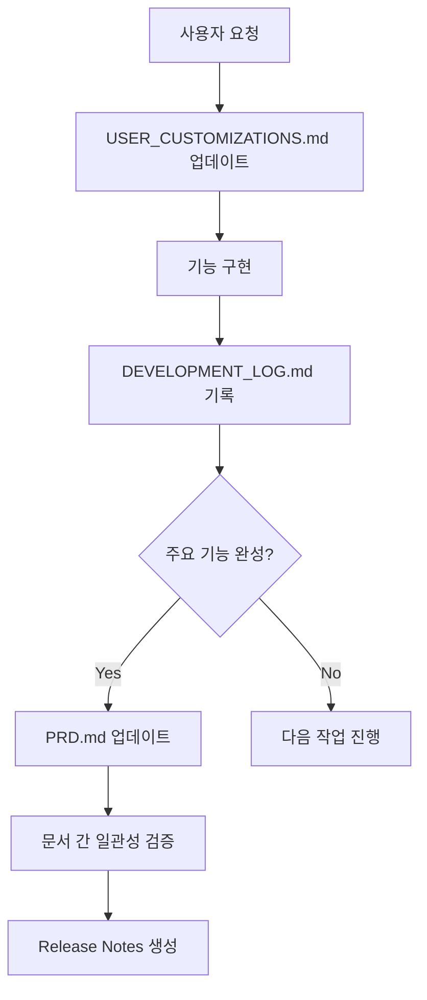

# 문서 Sync 관리 전략

## 문서 계층 구조

```
📋 PRD.md (Product Requirements Document)
├── 📝 기능 명세 및 비즈니스 요구사항
├── 🎯 사용자 페르소나 및 사용 시나리오
└── 📊 시스템 아키텍처 개요

📋 USER_CUSTOMIZATIONS.md (사용자 맞춤 기능 추적)
├── ✅ 구현 완료된 세부 기능
├── 🔧 진행 중인 개선사항
├── 🚨 해결된 기술적 이슈
└── 📋 향후 적용 예정 요청사항

📋 DEVELOPMENT_LOG.md (개발 진행 상황)
├── 🏗️ 스프린트별 개발 현황
├── 🐛 버그 수정 내역
├── 🎨 UI/UX 개선 히스토리
└── 📈 성능 최적화 기록
```

## Sync 관리 원칙

### 1. 문서 역할 분담

#### PRD.md (마스터 문서)
- **역할**: 제품의 전체적인 비전, 요구사항, 아키텍처 정의
- **업데이트 시점**: 새로운 기능 추가, 요구사항 변경 시
- **관리 주체**: 제품 오너, 프로젝트 매니저

#### USER_CUSTOMIZATIONS.md (실행 추적)
- **역할**: 사용자 요청사항의 실제 구현 상태 추적
- **업데이트 시점**: 기능 구현 완료, 버그 수정 시
- **관리 주체**: 개발자, AI 어시스턴트

#### DEVELOPMENT_LOG.md (진행 기록)
- **역할**: 개발 과정의 상세한 히스토리 관리
- **업데이트 시점**: 개발 세션 완료 시
- **관리 주체**: 개발 팀

### 2. 동기화 워크플로우



### 3. 자동화 스크립트

#### sync-documents.js (문서 동기화 스크립트)
```javascript
// 문서 간 일관성 검증 및 자동 업데이트
// npm run docs:sync
```

#### generate-changelog.js (변경사항 자동 생성)
```javascript
// USER_CUSTOMIZATIONS.md → CHANGELOG.md 자동 생성
// npm run docs:changelog
```

## 실제 Sync 관리 방법

### 일일 개발 종료 시
1. **USER_CUSTOMIZATIONS.md 업데이트**
   - 완료된 기능 ✅ 체크
   - 해결된 이슈 기록
   - 새로운 요청사항 추가

2. **DEVELOPMENT_LOG.md 기록**
   - 당일 작업 내용 요약
   - 발생한 문제와 해결책
   - 다음 작업 계획

### 주요 마일스톤 완료 시
1. **PRD.md 검토 및 업데이트**
   - 새로운 기능이 PRD와 일치하는지 확인
   - 변경된 요구사항 반영
   - 아키텍처 변경사항 업데이트

2. **문서 간 일관성 검증**
   - 모든 문서의 기능 설명 일치 확인
   - 버전 정보 동기화
   - 스크린샷 및 다이어그램 업데이트

### 릴리즈 준비 시
1. **통합 문서 생성**
   - CHANGELOG.md 자동 생성
   - RELEASE_NOTES.md 작성
   - 사용자 가이드 업데이트

## 도구 및 명령어

### 문서 관리 명령어
```bash
# 전체 문서 동기화
npm run docs:sync

# 문서 동기화 검증만 수행
npm run docs:verify

# CHANGELOG만 업데이트
npm run docs:changelog

# 실시간 파일 변경 감지 및 자동 동기화
npm run docs:watch
```

### 자동화 시스템

#### Git Hook 통합
```bash
# ✅ 구현됨
.husky/pre-commit    # 커밋 전 문서 일관성 검증
.husky/post-commit   # 커밋 후 CHANGELOG 자동 업데이트

# 향후 추가 예정
.husky/pre-push      # 푸시 전 문서 완전성 검사
```

#### GitHub Actions 자동화
```yaml
# ✅ 구현됨
.github/workflows/docs-sync.yml
- PR에서 문서 변경 시 자동 검증
- 매일 오전 9시 정기 검사
- 수동 실행 가능
```

#### 실시간 감시 시스템
```bash
# ✅ 구현됨
npm run docs:watch
- USER_CUSTOMIZATIONS.md 변경 감지
- PRD.md 변경 감지
- 자동 동기화 실행 (5초 쿨다운)
```

## 품질 보장

### 문서 검증 체크리스트
- [ ] 모든 구현된 기능이 3개 문서에 모두 반영되었는가?
- [ ] 버전 정보가 일치하는가?
- [ ] 스크린샷이 최신 상태인가?
- [ ] 사용자 요청사항이 누락되지 않았는가?
- [ ] 기술적 이슈가 적절히 문서화되었는가?

### 정기 검토 프로세스
- **일일**: USER_CUSTOMIZATIONS.md 업데이트
- **주간**: 문서 간 일관성 검증
- **월간**: PRD.md 전면 검토 및 업데이트
- **릴리즈**: 모든 문서 통합 검증

---

*이 문서는 프로젝트의 문서 관리 전략을 정의하며, 지속적으로 개선됩니다.*
*마지막 업데이트: 2025-08-01*