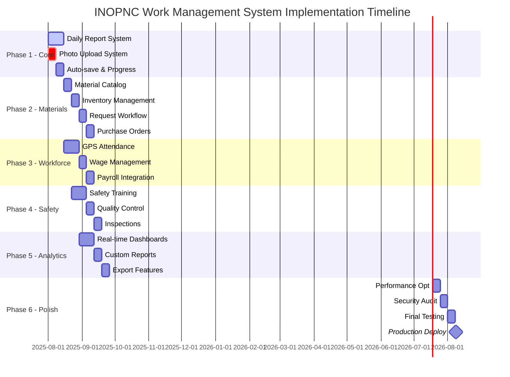
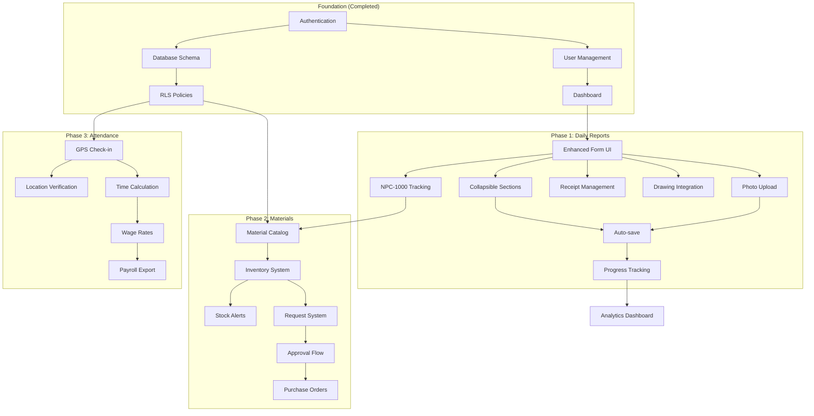
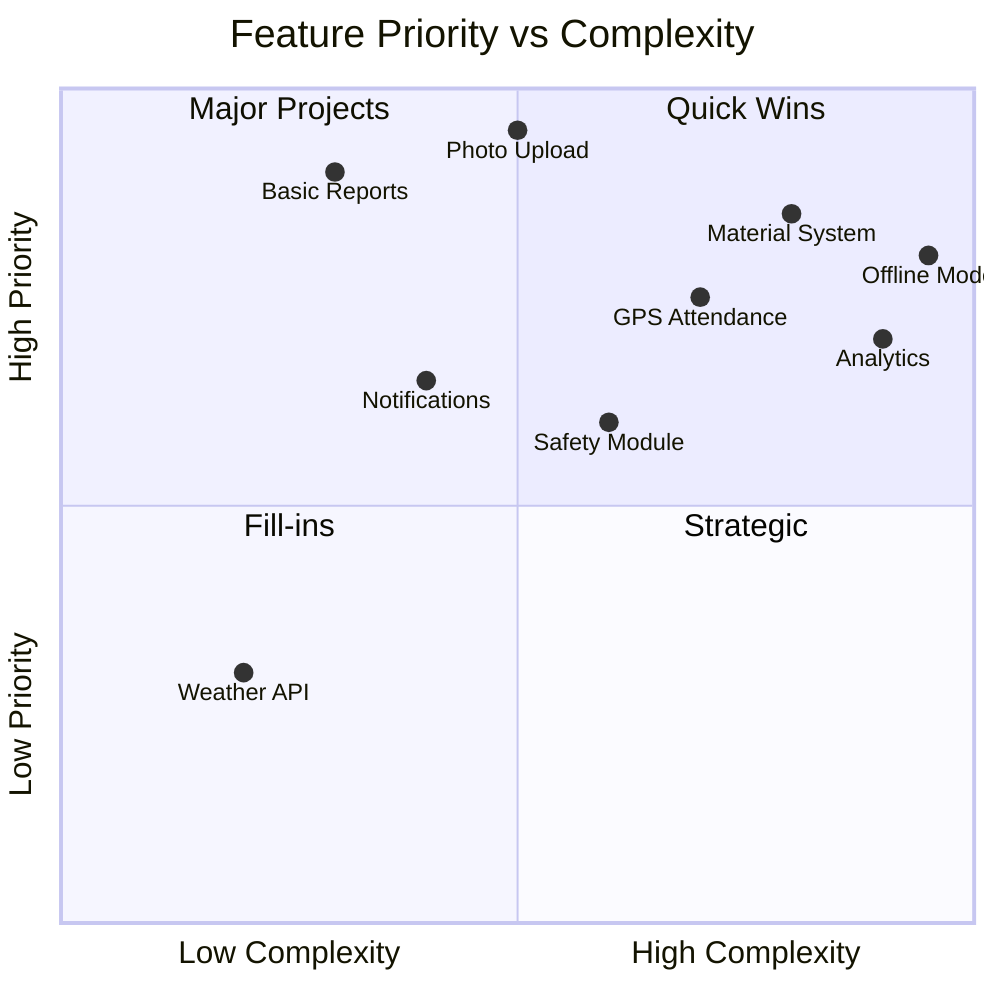

# INOPNC WMS Implementation Roadmap

## Visual Timeline & Dependencies



## Feature Dependency Graph



## Implementation Priority Matrix



## Sprint Breakdown - Phase 1 Detail

### Sprint 1.1: Form UI Enhancement (Week 1, Days 1-3)

```typescript
// Tasks with hour estimates
const sprint_1_1 = {
  "Collapsible Sections": {
    hours: 8,
    subtasks: [
      "Create CollapsibleSection component",
      "Add expand/collapse animations",
      "Persist user preferences",
      "Implement 'expand all/collapse all'"
    ]
  },
  "Photo Upload System": {
    hours: 12,
    subtasks: [
      "Create PhotoUpload component",
      "Implement drag-and-drop",
      "Add camera integration",
      "Gallery selection UI",
      "30-photo limit logic",
      "Thumbnail generation"
    ]
  },
  "Receipt Attachments": {
    hours: 6,
    subtasks: [
      "Receipt upload component",
      "Category selection",
      "Amount input validation",
      "Date picker integration"
    ]
  }
}
```

### Sprint 1.2: Advanced Features (Week 1, Days 4-5)

```typescript
const sprint_1_2 = {
  "NPC-1000 Material Section": {
    hours: 8,
    subtasks: [
      "Material input fields",
      "Quantity calculations",
      "Stock validation",
      "Real-time updates"
    ]
  },
  "Worker Assignment": {
    hours: 10,
    subtasks: [
      "Multi-select worker list",
      "공수 (0.0-3.0) dropdown",
      "Total hours calculation",
      "Validation rules"
    ]
  },
  "Auto-save Feature": {
    hours: 8,
    subtasks: [
      "5-minute interval timer",
      "Draft state management",
      "Conflict resolution",
      "Save indicator UI"
    ]
  }
}
```

## Database Schema Updates for Phase 1

```sql
-- New tables needed for enhanced daily reports
CREATE TABLE daily_report_photos (
    id UUID PRIMARY KEY DEFAULT gen_random_uuid(),
    daily_report_id UUID REFERENCES daily_reports(id),
    photo_type TEXT CHECK (photo_type IN ('before', 'after')),
    file_url TEXT NOT NULL,
    caption TEXT,
    upload_order INTEGER,
    created_at TIMESTAMP WITH TIME ZONE DEFAULT NOW()
);

CREATE TABLE daily_report_receipts (
    id UUID PRIMARY KEY DEFAULT gen_random_uuid(),
    daily_report_id UUID REFERENCES daily_reports(id),
    category TEXT NOT NULL,
    amount DECIMAL(10,2) NOT NULL,
    receipt_date DATE NOT NULL,
    file_url TEXT NOT NULL,
    notes TEXT,
    created_at TIMESTAMP WITH TIME ZONE DEFAULT NOW()
);

CREATE TABLE daily_report_requests (
    id UUID PRIMARY KEY DEFAULT gen_random_uuid(),
    daily_report_id UUID REFERENCES daily_reports(id),
    request_content TEXT NOT NULL,
    status TEXT DEFAULT 'pending',
    response TEXT,
    responded_by UUID REFERENCES profiles(id),
    responded_at TIMESTAMP WITH TIME ZONE,
    created_at TIMESTAMP WITH TIME ZONE DEFAULT NOW()
);

-- Add columns to existing tables
ALTER TABLE daily_reports 
ADD COLUMN auto_saved_at TIMESTAMP WITH TIME ZONE,
ADD COLUMN completion_percentage INTEGER DEFAULT 0,
ADD COLUMN drawing_attachments UUID[],
ADD COLUMN member_name_other TEXT,
ADD COLUMN process_type_other TEXT;
```

## API Endpoints for Phase 1

```typescript
// New API endpoints needed
const phase1APIs = {
  // Auto-save
  "POST /api/daily-reports/:id/auto-save": {
    description: "Auto-save draft data",
    payload: "Partial daily report data",
    response: "Save confirmation with timestamp"
  },
  
  // Photo management
  "POST /api/daily-reports/:id/photos": {
    description: "Upload before/after photos",
    payload: "FormData with photo files",
    response: "Photo URLs and metadata"
  },
  
  "DELETE /api/daily-reports/:id/photos/:photoId": {
    description: "Delete uploaded photo",
    response: "Deletion confirmation"
  },
  
  // Material tracking
  "GET /api/materials/inventory/:siteId": {
    description: "Get current material inventory",
    response: "Material stock levels"
  },
  
  "POST /api/daily-reports/:id/materials": {
    description: "Update material usage",
    payload: "Material quantities",
    response: "Updated inventory"
  },
  
  // Worker assignment
  "POST /api/daily-reports/:id/workers": {
    description: "Assign workers with 공수",
    payload: "Worker assignments array",
    response: "Assignment confirmation"
  }
}
```

## Component Architecture for Phase 1

```typescript
// Component structure
const componentArchitecture = {
  "DailyReportForm": {
    children: [
      "BasicInfoSection",
      "CollapsibleSection",
      {
        "SiteInfoSection": ["SiteSelector", "SiteDetails"],
        "WorkContentSection": ["MemberDropdown", "ProcessDropdown", "LocationInput"],
        "WorkerAssignmentSection": ["WorkerMultiSelect", "WorkHoursInput"],
        "PhotoUploadSection": ["PhotoUploader", "PhotoGallery", "PhotoPreview"],
        "ReceiptSection": ["ReceiptUploader", "ReceiptList"],
        "DrawingSection": ["DrawingUploader", "DrawingPreview"],
        "RequestSection": ["RequestTextarea", "RequestAttachments"],
        "MaterialSection": ["MaterialInputs", "StockDisplay"],
        "NotesSection": ["NotesTextarea"]
      }
    ],
    hooks: [
      "useAutoSave",
      "useFormProgress",
      "usePhotoUpload",
      "useOfflineSync"
    ]
  }
}
```

## Performance Optimization Strategy

```typescript
// Performance targets and optimizations
const performanceStrategy = {
  targets: {
    formLoad: "< 1 second",
    photoUpload: "< 3 seconds per photo",
    autoSave: "< 500ms",
    pageSize: "< 2MB initial load"
  },
  
  optimizations: [
    {
      technique: "Lazy Loading",
      apply: ["Photo galleries", "Receipt previews", "Worker lists"]
    },
    {
      technique: "Debouncing",
      apply: ["Auto-save", "Search inputs", "Calculations"]
    },
    {
      technique: "Virtual Scrolling",
      apply: ["Long worker lists", "Material catalogs"]
    },
    {
      technique: "Image Optimization",
      apply: ["Thumbnail generation", "WebP conversion", "Lazy load"]
    },
    {
      technique: "Code Splitting",
      apply: ["Route-based splitting", "Component lazy imports"]
    }
  ]
}
```

## Testing Strategy

### Unit Tests (Phase 1)
```typescript
describe('Daily Report Form', () => {
  test('Collapsible sections maintain state', () => {})
  test('Photo upload respects 30-photo limit', () => {})
  test('Auto-save triggers every 5 minutes', () => {})
  test('Worker 공수 calculations are accurate', () => {})
  test('Material quantities update correctly', () => {})
})
```

### Integration Tests
```typescript
describe('Daily Report Workflow', () => {
  test('Complete form submission flow', () => {})
  test('Offline mode data sync', () => {})
  test('Concurrent user editing', () => {})
  test('File upload with progress', () => {})
})
```

### E2E Tests
```typescript
describe('User Scenarios', () => {
  test('Worker creates and submits daily report', () => {})
  test('Manager reviews and approves report', () => {})
  test('Photo upload from mobile camera', () => {})
  test('Offline report syncs when online', () => {})
})
```

## Mobile-Specific Considerations

```typescript
const mobileOptimizations = {
  UI: {
    "Touch targets": "Minimum 44x44px",
    "Thumb zones": "Bottom navigation for actions",
    "Gestures": "Swipe between sections",
    "Keyboard": "Avoid covering inputs"
  },
  
  Performance: {
    "Image loading": "Progressive with placeholders",
    "Network": "Offline-first with background sync",
    "Storage": "IndexedDB for draft data",
    "Battery": "Reduce animations on low battery"
  },
  
  Features: {
    "Camera": "Direct capture integration",
    "GPS": "Automatic location tagging",
    "Notifications": "Push for approvals",
    "Shortcuts": "PWA home screen"
  }
}
```

## Risk Mitigation Checklist

- [ ] **Large file uploads**: Implement chunked upload with resume capability
- [ ] **Concurrent editing**: Add optimistic locking with version control
- [ ] **Data loss**: Auto-save to localStorage + server every 5 minutes
- [ ] **Performance degradation**: Set up monitoring and alerts
- [ ] **Security vulnerabilities**: Regular dependency updates and audits
- [ ] **Browser compatibility**: Test on Chrome, Safari, Firefox, Edge
- [ ] **Accessibility**: WCAG 2.1 AA compliance testing
- [ ] **Scalability**: Load testing with 1000+ concurrent users

## Success Metrics Dashboard

```typescript
const successMetrics = {
  technical: {
    "Form completion time": "< 10 minutes average",
    "Upload success rate": "> 99%",
    "Auto-save reliability": "> 99.9%",
    "Page load speed": "< 3 seconds on 3G"
  },
  
  business: {
    "User adoption": "> 80% in 30 days",
    "Report submission": "Same-day > 90%",
    "Data accuracy": "> 95% complete fields",
    "User satisfaction": "> 4.5/5 rating"
  }
}
```

## Deployment Strategy

### Staging Pipeline
```yaml
staging:
  - Code review approval
  - Automated tests pass
  - Build optimization
  - Deploy to staging
  - Smoke tests
  - UAT sign-off
```

### Production Pipeline
```yaml
production:
  - Feature flags enabled
  - Database migrations
  - Blue-green deployment
  - Health checks
  - Rollback plan ready
  - Monitoring alerts set
```

---

This visual roadmap complements the architect-level workflow plan, providing clear timelines, dependencies, and implementation details for the development team to follow.