# INOPNC WMS Implementation Workflow Diagram

## System Architecture Overview

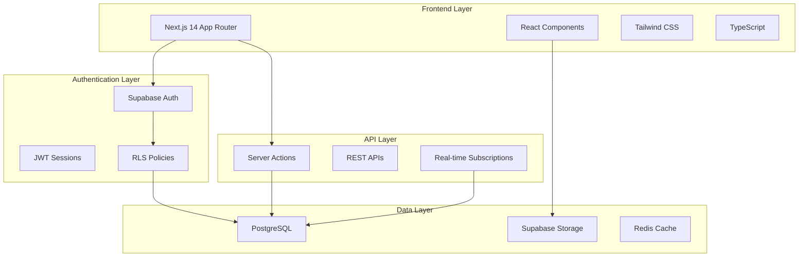

## Phase 1: Daily Report System Workflow

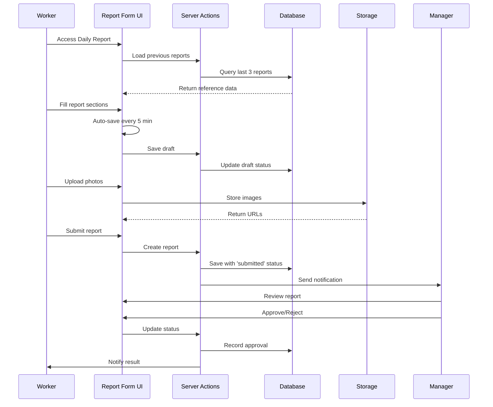

## Implementation Phases Timeline

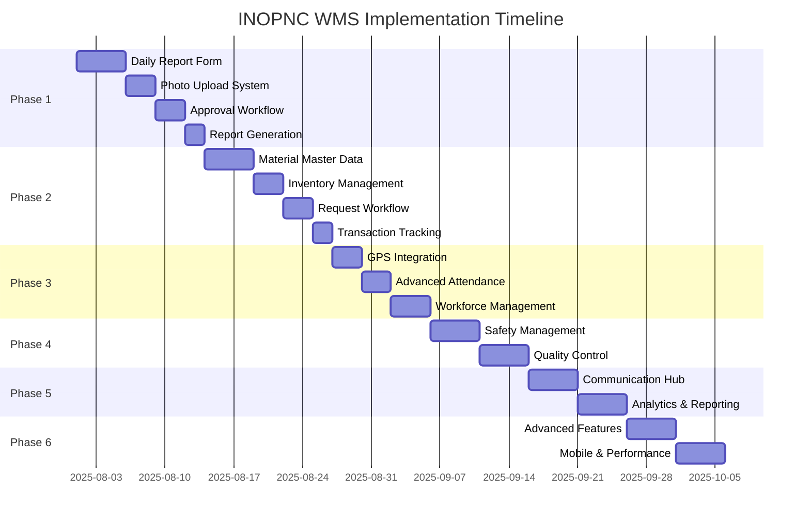

## Daily Report Form Component Structure

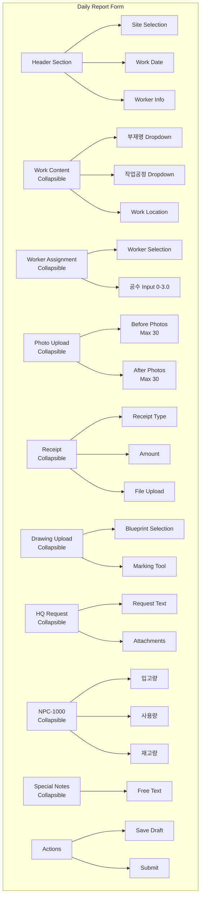

## Material Management Workflow

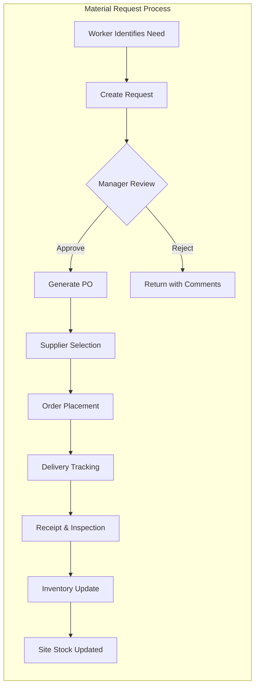

## Security & Permission Matrix

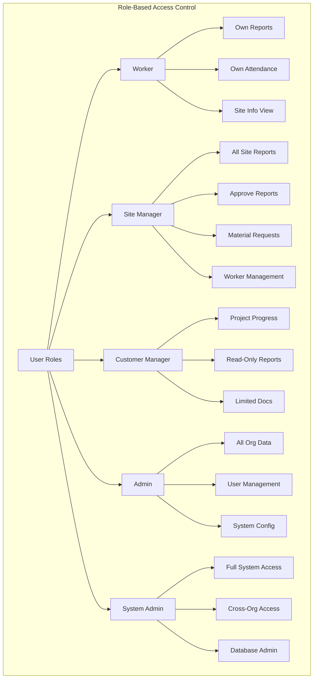

## Data Flow Architecture

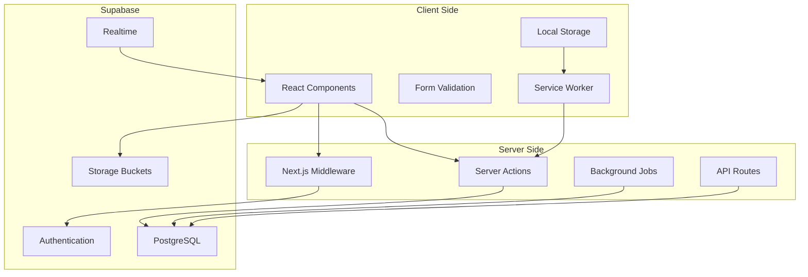

## Mobile-First Responsive Design

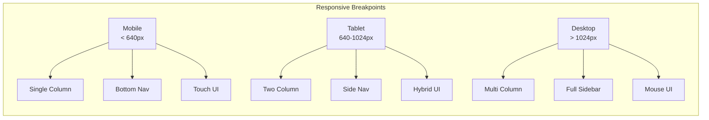

## Offline Sync Strategy

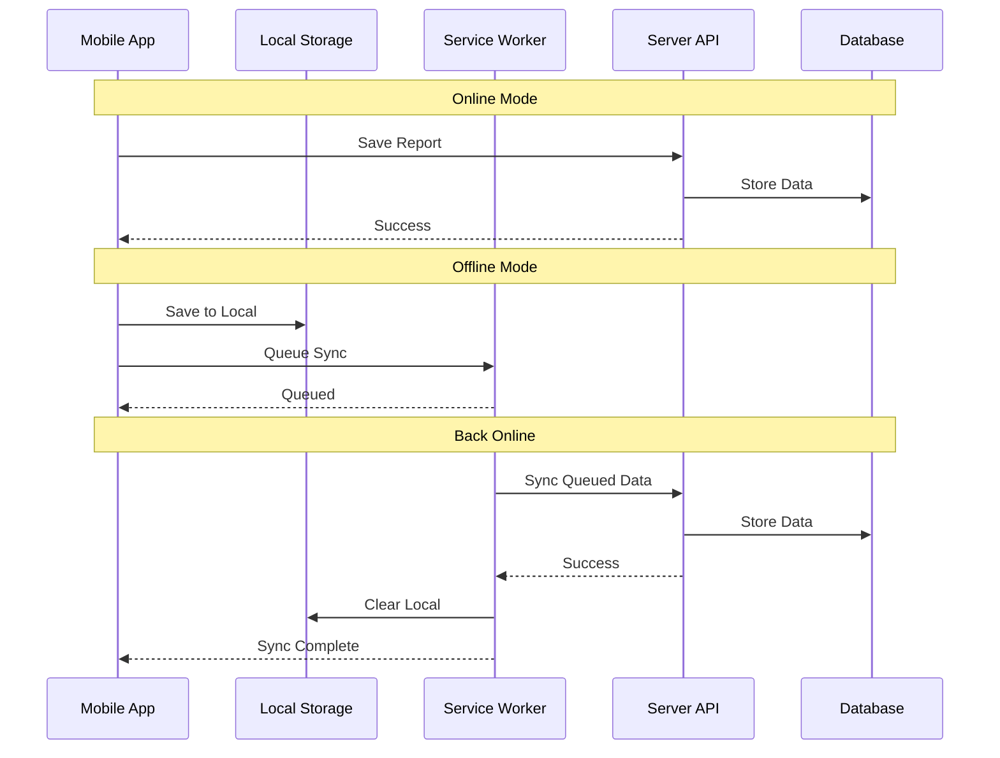

## Performance Optimization Strategy

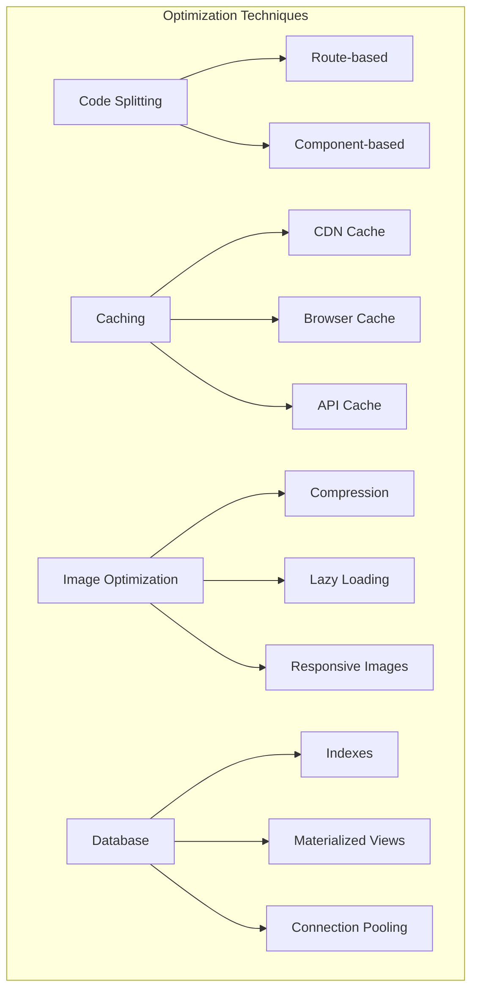

## Testing Strategy

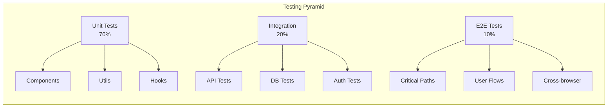

## Deployment Pipeline

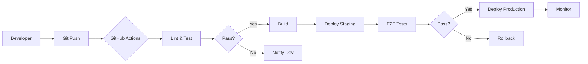

This comprehensive workflow diagram provides visual representations of:

1. System architecture and component relationships
2. Daily report submission workflow
3. Implementation timeline using Gantt chart
4. Component structure for the daily report form
5. Material management process flow
6. Security and permission matrix
7. Data flow between layers
8. Responsive design strategy
9. Offline sync mechanism
10. Performance optimization approach
11. Testing pyramid
12. CI/CD deployment pipeline

These diagrams serve as a visual guide for the development team to understand the system architecture, workflows, and implementation strategy at a glance.